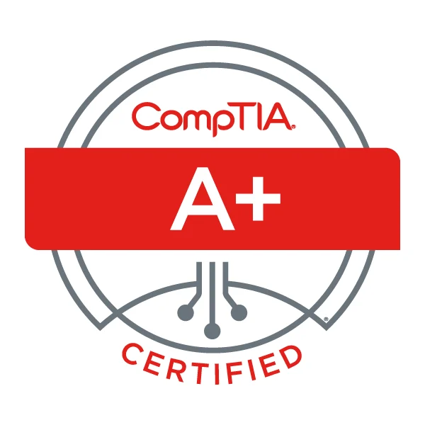
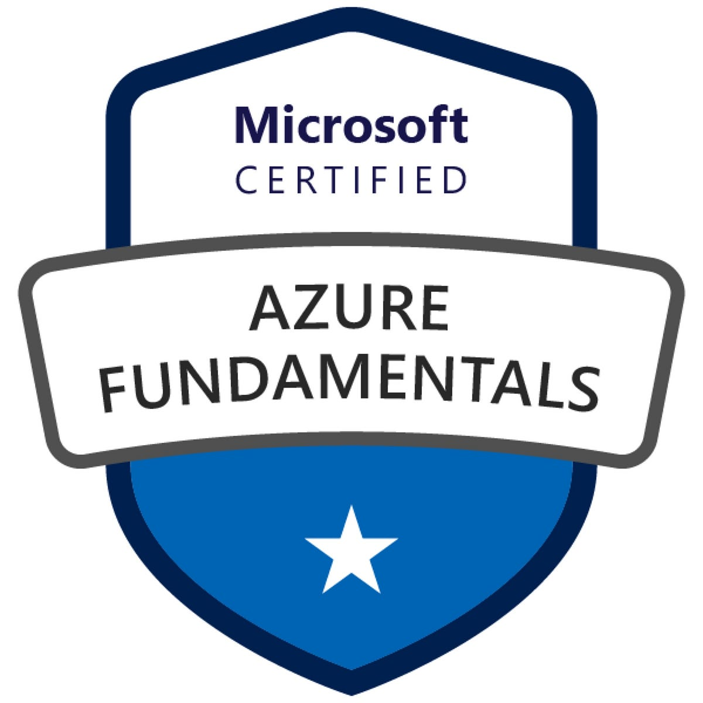

# IT Certification Study Notes

## Comptia A+

### Start Date: [6-3-2026]

### Target Completion: [7-3-2026]

| Certification | Status |
|---------------|--------|

| Course | Status |
|--------|--------|
| 1. [Cable Types](A+-notes/OBJ-3.2-&-3.4-CableTypes) | ⬜ Not Started |
| 2. | ⬜ Not Started |
| 3. | ⬜ Not Started |
| 4.  | ⬜ Not Started |
| 5. | ⬜ Not Started |

## Daily Log

| Date | Hours | Topic |
|------|-------|-------|
|6-11-2026|||

## AZ-900

### Start Date: [6-3-2026]

### Target Completion: [7-3-2026]

| Certification | Status |
|---------------|--------|

| Course | Status |
|--------|--------|
| 1. [Describe Cloud Concepts](azure-notes/describe-cloud-concepts) | ⬜ Not Started |
| 2. [Describe Azure Architecture and Services]()| ⬜ Not Started |
| 3. [Describe Azure Mnagement and Governance]() | ⬜ Not Started |
| 4.  | ⬜ Not Started |
| 5. | ⬜ Not Started |

## Daily Log

| Date | Hours | Topic |
|------|-------|-------|
|6-8-2026|||
